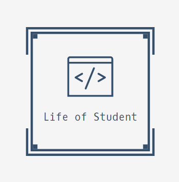

___  

<div align="center">
  
  <h2><b>( feat. Computer Science )</b></h2>
</div>

___  

# 😀 Project Title
  한남대학교 `웹스크립트 프로그래밍` 팀 프로젝트 **<컴공인의 삶>** 입니다. 

# 😏 PreCondition
- 프로젝트 진행과정에 대한 내용은 [`Project & Wiki`](https://github.com/JH9892/Life_of_Student#-project--wiki)탭을 참고하시면 됩니다.
- `main Page`의 경우 html5의 `semantic tag(= header, nav, main, footer, section, aside, article, etc...) `가 무조건 포함될 것.

# 😁 Coworker
| **Name** | **Github** | **Position** | **Comments** |
|:--------:|:-------:|:-------:|:-------:|
|이규호|[RottenTofu](https://github.com/RottenTofu)| Coworker | 하고 싶은거 다하고 갈게여~ |
|최재훈|[Giraffun](https://github.com/JH9892)| Coworker | 눈이 즐거운 웹페이지를 만들겠습니다! |
|신현수|[sinbak](https://github.com/sinbak)| Coworker | 제대로된 페이지 만들고 싶습니다!|
|심영훈|[Syh1999](https://github.com/Syh1999)| Coworker | 부족한 실력이지만 노력해보겠습니다.|
___  

# 😍 Project & Wiki
> 자세한 개발과정은 [Project - Wiki](https://github.com/JH9892/Life_of_Student/wiki)를 참고해주세요 :)


> 프로젝트 개발일정은 [Project - githubproject](https://github.com/JH9892/Life_of_Student/projects/1)를 봐주시면 됩니다! :)


# 😎 Page Constructor
```
< Project Dir tree>
-----------------------------------------
.
├─reference
├─src
├─index.html
├─README.md
└─static
    ├──css
        └─style.css
    ├──img
        └─logo.png
    └──js
        └─index.js
-----------------------------------------

```

**`Copyright 2021. JH9892, RottenTofu, sinbak, Syh1999. All creatures cannot be copied without permission.`**
